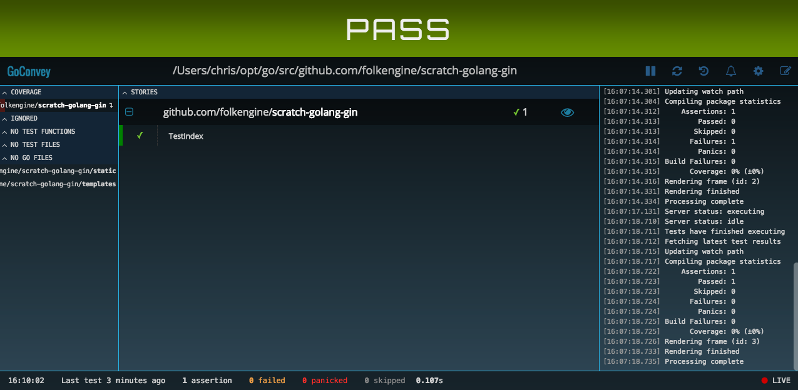

# Step by Step Guide 

This is a step by step guide to me working through Kulshekhar Kabra's [Building Go Web Applications and Microservices Using Gin
](https://semaphoreci.com/community/tutorials/building-go-web-applications-and-microservices-using-gin) tutorial.

## Adding Gogland to .gitignore

I've been a big fan of Jetbrain's [Gogland IDE](https://www.jetbrains.com/go/). 
Of course, every time you use a Jetbrains IDE on a git repo you've got to add
tge .idea directory to your .gitignore file. 

## Glide init

I've been using [Glide](https://glide.sh/) for my go dependency management.

```
$> cd scratch-golang-gin
$> glide init
```
 
## Install Gin

```
$> glide get github.com/gin-gonic/gin
```

## Create the Templates

Note that I'm using the .template extension for templates instead of .html. 
Using html extension for something that isn't a working html page just feels wrong to
this ol' web dev.

## Create our first test

We begin by creating a simple test that just shows us that we are able to set Gin into Test Mode, 
create a router, and run a test from the command line.

```
$> go test
PASS
ok  	github.com/folkengine/scratch-golang-gin	0.438s
```

## Add goconvey

We're going to us [goconvey](https://github.com/smartystreets/goconvey) to our project so we can 
test drive our code.

```
$> glide get github.com/smartystreets/goconvey
```

We also need to install the binary onto our system, and run it:

```
$> go get -t github.com/smartystreets/goconvey
$> GOPATH/bin/goconvey
```

Your browser should now open up, and showing you your initial passing test:



## Testing HTML 

Our first goconvet test is to check the status of our index page. We can do this with
an [httptest](https://golang.org/pkg/net/http/httptest/) Recorder.

```
func TestIndex(t *testing.T) {
	Convey("Given that I go to the index page", t, func() {
		req, _ := http.NewRequest("GET", "/", nil)
		resp := httptest.NewRecorder()
		router.ServeHTTP(resp, req)
		
		Convey("it should return a 200 status code", func() {
			So(resp.Code, ShouldEqual, http.StatusOK)
		})
	})
}
```

## Testing HTML Content

Now we want to validate that the title for the index page is correct, mainly so that
we can feel comfortable with parsing html. For this we'll use goquery.

```
$> glide get github.com/PuerkitoBio/goquery
```

We'll add a helper method that returns the text content of the field we pass in,
 using strings to convert the bytes buffer to an io Reader:

```
func getField(body *bytes.Buffer, fieldname string) string {
	doc, _ := goquery.NewDocumentFromReader(strings.NewReader(body.String()))
	return doc.Find(fieldname).Text()
}
```

Here's the test we add that uses that helper method.

```
	Convey("it should have the title of Home Page", func() {
		So(getField(resp.Body, "title"), ShouldEqual, "Home Page")
	})

```
